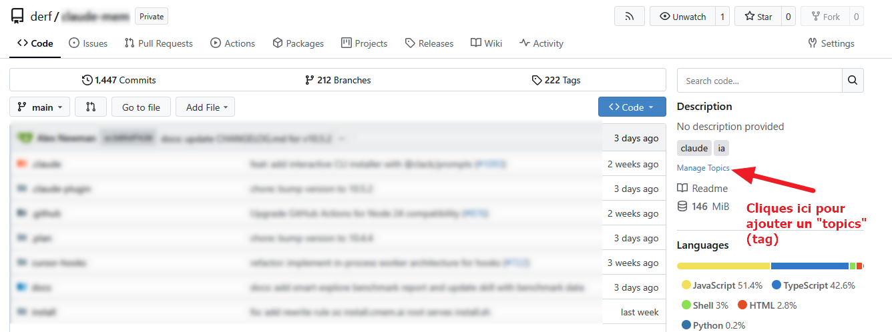

# Self-Host (Docker) Gitea sur un Raspberry Pi 4 4GB

## Installation rapide de Docker (Ubuntu)
```bash
# Installer Docker Engine + Compose v2
curl -fsSL https://get.docker.com | sudo sh

# Ajouter l'utilisateur au groupe docker (éviter sudo)
sudo usermod -aG docker $USER
newgrp docker

# Vérifier l'installation
docker run hello-world

# Vérifier Docker Compose v2
docker compose version
```

## Installation Gitea 
```bash
cd /home/pi/gitea && vi docker-compose.yml
```
```yml
# docker-compose.yml — Gitea optimisé Raspberry Pi
# Compose v2.xx
# Ce docker compose est optimisé pour un usage SQLite  -> configuration dans app.ini de la .db

networks:
  gitea:
    external: false

services:
  server:
    image: gitea/gitea:latest
    container_name: gitea
    restart: always
    networks:
      - gitea
    environment:
      - USER_UID=1000
      - USER_GID=1000
    volumes:
       #  répertoire de données Gitea (config, BDD, repos, logs...)
      - ./gitea:/data
       # uniquement le sous-dossier repositories / utile en cas de crash, car dépôt intact et indépendant → repos récupérables
      - /home/pi/gitea/git/repositories:/data/git/repositories
      - /etc/timezone:/etc/timezone:ro
      - /etc/localtime:/etc/localtime:ro
    ports:
      - "3000:3000"
      - "2222:22"
    healthcheck:
      test: ["CMD", "curl", "-f", "http://localhost:3000/"]
      interval: 60s
      timeout: 10s
      retries: 3
      start_period: 30s
    deploy:
      resources:         # Exemple avec RPI 4 avec 4GB Ram
        limits:
          memory: 1G      # confortable, laisse 3G pour l'OS et les autres services
          cpus: "2.0"     # RPi 4 = 4 cœurs, 2 alloués est raisonnable
```


## Limiter l'accès à Gitea 

**A faire une fois le compte Admin créé !**
```bash
docker exec -it gitea vi /data/gitea/conf/app.ini
```
```bash
# Modifier ces valeur pour bloquer les enregistrements / seules les personnes déjà enregistrée peuvent accéder 
[service]
DISABLE_REGISTRATION = true
REQUIRE_SIGNIN_VIEW = true

[database] # a la place de PGSQL pour une usge single user ! sinon préféré PGSQL pour du multiuser et adapter le docker compose !
DB_TYPE = sqlite3
PATH    = /data/gitea/gitea.db

# Facultatif - désactiver openid car non utilisé pour le moment 
[openid]
ENABLE_OPENID_SIGNIN = false
ENABLE_OPENID_SIGNUP = false

[indexer]
ISSUE_INDEXER_PATH = /data/gitea/indexers/issues.bleve
REPO_INDEXER_ENABLED = true
REPO_INDEXER_PATH = /data/gitea/indexers/repos.bleve

[git.timeout]
DEFAULT = 3600
MIGRATE = 3600
MIRROR  = 3600
CLONE   = 3600
PULL    = 3600
GC      = 3600
```

##  Ajout topics/tags 

- Il faut combiner les **Organizations** (comme classeurs) avec les **Tags** pour organiser efficacement un grand nombre de dépôts.

📷


## Suppression par erreur `container-images-network`

Si une suppression par erreur du container-images-network est faite et que le volume local est toujours présent `(/home/pi/gitea/git/repositories)`. Il faut réimporter après l'exécution du nouveau container manuellement les dépots via le  GUI :
  - http://10.0.0.xxx:3000/user/settings/repos
  - Il faut simplement aller sous **"Configuration"-  "dépots"  et "Adopter les fichiers"**


## Backup dépôts GIT

**Les dépôts GIT importés se trouvent à cet emplacement dans le container:** `/data/git/repositories/`
```bash
docker exec -u git gitea ls -la /data/git/repositories/
```

- Informations pour backup manuel
```bash
###################
# SAUVEGARDES GITEA 
###################
 

# ─────────────────────────────────────────────
# 1) Sauvegarde des dépôts Gitea directement sur l'hôte (méthode recommandée)
# ─────────────────────────────────────────────
docker exec gitea tar -cz /data/git/repositories > /home/pi/gitea-repos.tar.gz
# Vérifier que l'archive est bien créée et non vide
ls -lh /home/pi/gitea-repos.tar.gz
# Lister le contenu sans extraire
tar -tzf /home/pi/gitea-repos.tar.gz | head -20

# ─────────────────────────────────────────────
# 2) Sauvegarde des dépôts Gitea via fichier créé dans le conteneur
# ─────────────────────────────────────────────
docker exec gitea tar -czvf /tmp/gitea-repos.tar.gz /data/git/repositories
docker cp gitea:/tmp/gitea-repos.tar.gz /home/pi/


# ─────────────────────────────────────────────
# 3) Sauvegarde complète Gitea (dépôts + config + avatars + index + logs)
# ─────────────────────────────────────────────
docker exec gitea tar -czvf /tmp/gitea-full-backup.tar.gz /data
docker cp gitea:/tmp/gitea-full-backup.tar.gz .


# Contenu de l'archive complète :
#   - dépôts : /data/git/repositories/
#   - config : /data/gitea/conf/app.ini
#   - avatars : /data/gitea/avatars/
#   - attachments : /data/gitea/attachments/
#   - indexers, sessions, logs, etc.


###############
#  RESTAURATION
###############

# ─────────────────────────────────────────────
# Restauration des dépôts seuls
# ─────────────────────────────────────────────
tar -xzvf gitea-repos.tar.gz -C /srv/gitea/git/


# ─────────────────────────────────────────────
# Restauration complète Gitea
# ─────────────────────────────────────────────
tar -xzvf gitea-full-backup.tar.gz -C /srv/gitea/
```

- Backup avec Script 
```bash
cd /home/pi/backups/gitea && vi backup_gitea.bash
```
```bash
#!/bin/bash

BACKUP_DIR="/home/pi/backups/gitea"
TIMESTAMP=$(date +"%Y%m%d_%H%M%S")
GITEA_DATA="/home/pi/gitea"
GITEA_REPOS="/home/pi/gitea/git/repositories"
CONTAINER_NAME="gitea"

mkdir -p "$BACKUP_DIR"

echo "================================================"
echo " 🔍 Test Backup Gitea — $TIMESTAMP"
echo "================================================"

# --- Tailles avant backup ---
echo ""
echo "📊 Tailles des sources :"
sudo du -sh "$GITEA_DATA" --exclude="$GITEA_REPOS"
sudo du -sh "$GITEA_REPOS"
sudo find "$GITEA_DATA" -name "*.db" -ls

# --- Arrêt conteneur ---
docker stop "$CONTAINER_NAME" 2>/dev/null && echo "✅ Conteneur arrêté"

# --- Backup données ---
sudo tar -czf "$BACKUP_DIR/gitea-data_$TIMESTAMP.tar.gz" \
    --exclude="$GITEA_DATA/git/repositories" \
    "$GITEA_DATA" \
    && echo "✅ gitea-data sauvegardé" \
    || echo "❌ Échec gitea-data"

# --- Backup repos ---
sudo tar -czf "$BACKUP_DIR/gitea-repos_$TIMESTAMP.tar.gz" \
    "$GITEA_REPOS" \
    && echo "✅ gitea-repos sauvegardé" \
    || echo "❌ Échec gitea-repos"

# --- Redémarrage ---
docker start "$CONTAINER_NAME" 2>/dev/null && echo "✅ Conteneur redémarré"

# --- Résumé comparatif ---
echo ""
echo "📦 Résultat archives :"
echo "---"
ls -lh "$BACKUP_DIR"/*"$TIMESTAMP"*
echo "---"
echo "📁 Contenu gitea-data :"
tar -tzf "$BACKUP_DIR/gitea-data_$TIMESTAMP.tar.gz" | grep "\.db\|\.ini\|\.pem"
echo "---"
du -sh "$BACKUP_DIR"
```

Exécution du script 
```bash
sudo bash backup_gitea.bash
```


## Restauration 
```bash 
# Remplace TIMESTAMP par la valeur réelle, ex : gitea-data_20260309_132717.tar.gz.
sudo tar -xzf gitea-data_TIMESTAMP.tar.gz  -C /
sudo tar -xzf gitea-repos_TIMESTAMP.tar.gz -C /
```


# Avec Certificat auto-signé (pour du local uniquement )

## Gitea — Configuration SSL Auto-Signé (Natif)

> **Contexte** : Gitea déployé via Docker sur réseau local, sans domaine public.  
> **Objectif** : Chiffrement HTTPS avec certificat auto-signé généré nativement par Gitea.

---

Prérequis

- Container Gitea opérationnel (`docker ps | grep gitea`)
- Accès SSH au serveur host
- IP locale du serveur : `10.0.0.xxx` = **A adapter**

---

## Étape 1 — Générer le certificat SSL
```bash
docker exec -u git gitea gitea cert \
  --host 10.0.0.xxx \
  --out /data/gitea/cert.pem \
  --keyout /data/gitea/key.pem
```

> Génère un certificat auto-signé valide 1 an dans `/data/gitea/`.

---

## Étape 2 — Modifier la **configuration app.ini**
```bash
docker exec -it gitea vi /data/gitea/conf/app.ini
```

Modifier ou ajouter la section `[server]` :
```ini
[server]
APP_DATA_PATH    = /data/gitea
DOMAIN           = 10.0.0.xxx
SSH_DOMAIN       = 10.0.0.xxx
HTTP_PORT        = 3000
ROOT_URL         = https://10.0.0.xxx:3000/
DISABLE_SSH      = false
SSH_PORT         = 22
SSH_LISTEN_PORT  = 22
LFS_START_SERVER = true
LFS_JWT_SECRET   = <YOUR_LFS_JWT_SECRET>
OFFLINE_MODE     = true
PROTOCOL         = https
CERT_FILE        = /data/gitea/cert.pem
KEY_FILE         = /data/gitea/key.pem
```

## Étape 3 — Redémarrer le container
```bash
docker restart gitea
```


## Étape 4 — Vérifier le bon fonctionnement
```bash
curl -k https://10.0.0.xxx:3000/api/v1/version
# Réponse attendue :
{"version":"1.25.4"}
```
> Le flag `-k` désactive la vérification du certificat côté curl — comportement normal pour un certificat auto-signé.


## Étape 5 — Configurer les postes clients Git

Pour éviter les erreurs SSL lors des opérations `git push` / `git pull` :
```bash
# Option 1 — Par dépôt uniquement (recommandé)
git config http.sslVerify false
# Option 2 — Globalement sur le poste (moins recommandé)
git config --global http.sslVerify false
```


## Comportement navigateur

Le navigateur affichera l'avertissement suivant :

⚠️ Votre connexion n'est pas privée


**Procédure pour accéder quand même :**

1. Cliquer sur **Avancé**
2. Cliquer sur **Continuer vers 10.0.0.xxx (non sécurisé)**

> Le trafic est bien **chiffré** malgré l'avertissement. Celui-ci indique uniquement que le certificat n'est pas signé par une autorité de certification reconnue publiquement.

---

## Renouvellement du certificat

Le certificat auto-signé expire après **1 an**. Pour le renouveler :
```bash
cd /home/pi/backups/gitea && vi renew_cert_gitea.sh
```
```bash
# Régénérer le certificat
docker exec -u root gitea openssl req -x509 -newkey rsa:4096 \
  -keyout /data/gitea/key.pem \
  -out /data/gitea/cert.pem \
  -days 365 -nodes \
  -subj "/CN=10.0.0.xxx"

docker exec -u root gitea chown git:git /data/gitea/cert.pem /data/gitea/key.pem
docker exec -u root gitea chmod 600 /data/gitea/key.pem
docker restart gitea
```

---

## Références

- [Gitea Documentation — HTTPS setup](https://docs.gitea.com/administration/https-setup)
- [Gitea app.ini — Server configuration](https://docs.gitea.com/administration/config-cheat-sheet#server-server)
